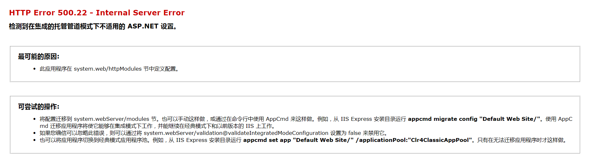
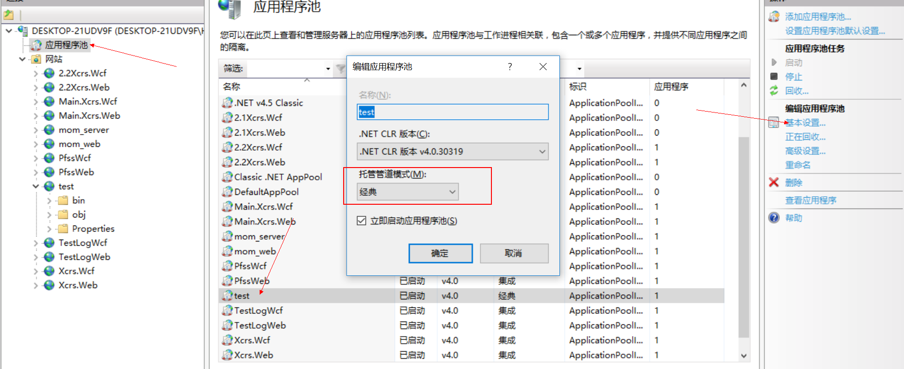

## Asp.net  Url过滤、重定向


### 1.编写一个类，继承 IHttpModule接口

```
using System;
using System.Web;
using System.Web.SessionState;

namespace FilterUrl
{
    public class PageFilter : IHttpModule
    {
        public void Dispose()
        {
            throw new NotImplementedException();
        }

        public void Init(HttpApplication application)
        {
            application.AcquireRequestState += new EventHandler(Application_AcquireRequestState);
        }

        private void Application_AcquireRequestState(Object source, EventArgs e)
        {

            HttpApplication app = (HttpApplication)source;
            HttpContext context = app.Context;
            HttpSessionState session = context.Session;
            HttpRequest request = context.Request;
            HttpResponse response = context.Response;
            String contextPath = request.ApplicationPath;
            var url = app.Request.Url;
            if (url.ToString().Contains("test.aspx"))
            {
                response.Redirect("Login.aspx");


                //app.Response.Write("非法路径");
                //app.Response.End();
            }

        }

    }
}
```


### 2.在webConfig中,<system.web> 节点中添加配置节点

```
 <system.web>
		<httpModules>
			<add name="pageModule" type="FilterUrl.PageFilter"/>
		</httpModules>
    </system.web>
```


注意，add name="pageModule" type="FilterUrl.PageFilter"/> 中 type 应该填写完整的路径（之前只是填写了PageFilter，一直提示无法加载PageFilter模块）


此时直接F5启动项目的话会报一个500.22的错误




百度过后，需要把项目放到IIS上面，并且把对应网站的应用程序池，修改成为“经典”模式




根据之前代码里面写的规则

```
if (url.ToString().Contains("test.aspx"))
            {
                response.Redirect("Login.aspx");


                //app.Response.Write("非法路径");
                //app.Response.End();
            }
```

遇到test.aspx就跳转到登录，经测试可行。同理，这里就可以做各种权限判断了


### 引申话题

在 init方法中

```
public void Init(HttpApplication application)
        {
            application.AcquireRequestState += new EventHandler(Application_AcquireRequestState);
        }
```

 application 对象调用的是 RequestState方法，其实application  对象中还有好多其他方法，**AcquireRequestState，还有诸如BeginRequest、AuthenticateRequest、AuthorizeRequest、ResolveRequestCache、AcquireRequestState、PreRequestHandlerExecute、PostRequestHandlerExecute、ReleaseRequestState、UpdateRequestCache、EndRequest**

这些方法 代表的是 请求的不同阶段，可以根据需求再不同的阶段做URL拦截，有一点需要注意的是

Session对象在BeginRequest阶段中是没有的，在AcquireRequestState及其以后阶段中才有的