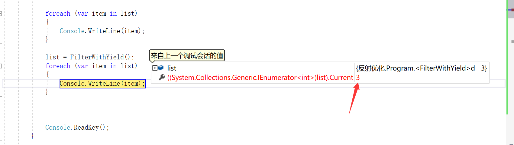
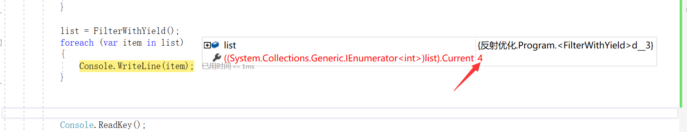

##  yield return

 根据逻辑筛选数组

以前的写法：

```
static IEnumerable<int> FilterWithoutYield()
{
  List<int> result = new List<int>();
  List < int > list= new List<int>() { 1, 2, 3, 4 };
  foreach (int i in list)
  {
 if (i > 2)
 {
   result.Add(i);
 } 
  }
  return result;
}
```

调用：

```
 var list = FilterWithoutYield();

foreach (var item in list)
{
	Console.WriteLine(item);
}
```

在断点调试list的时候，显示他有两个元素[3,4]


用yield return 实现

```
 static IEnumerable<int> FilterWithYield()
        {
            List < int > list= new List<int>() { 1, 2, 3, 4 };
            foreach (int i in list)
            {
                if (i > 2)
                {
                    yield return i;
                }
            }
            yield break;
        }
```


调用的时候调试list,直接就包含了3，4 这两个元素

```
var list = FilterWithYield();
foreach (var item in list)
{
	Console.WriteLine(item);
}
```

在Console.WriteLine(item);这里断点,

第一次循环list对象的值：



第二次循环list对象的值:




两种方法的区别在于：

第一种，是根据逻辑计算以后把所有的结果保存到一个变量(内存)里面，然后返回这个变量给调用者。

第二种，是每次符合的逻辑的元素，单独返回给客户的，然后第二次会接着上次的顺序继续遍历

简单地说，**当希望获取一个IEnumerable<T>类型的集合，而不想把数据一次性加载到内存，就可以考虑使用yield return实现"**按需供给