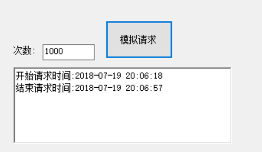
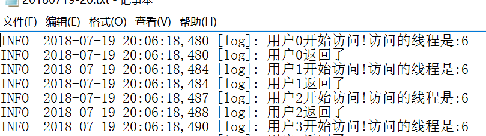
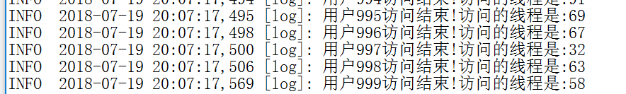

[async &await](https://docs.microsoft.com/zh-cn/dotnet/csharp/programming-guide/concepts/async/index)

[深入了解异步](https://docs.microsoft.com/zh-cn/dotnet/standard/async-in-depth)

[异步编程模式](https://docs.microsoft.com/zh-cn/dotnet/standard/asynchronous-programming-patterns/)


### 1.异步不等待返回值

起了一个webapi的项目,大意就是请求API 然后执行一个 休眠3秒的方法，然后回调（为了记录日志，其实可以不用）

```c#
public object Post([FromBody]testObj obj)
{
  string id = obj.id;
  LogHelper.Info(string.Format("{0}开始访问!访问的线程是:{1}",id, Thread.CurrentThread.ManagedThreadId));
  mydelegate = new MyDelegate(TestMethod);
  IAsyncResult result = mydelegate.BeginInvoke(id, TestCallback, null);

  LogHelper.Info(string.Format("{0}返回了", id));
  return new {state="0",success="true" }.ToJson();
}

public string TestMethod(object data)
{
  string datastr = data.ToString();
  System.Threading.Thread.Sleep(3000);
  return datastr;
}


public delegate string MyDelegate(object data);
private MyDelegate mydelegate = null;
public void TestCallback(IAsyncResult data)
{
  string datastr = mydelegate.EndInvoke(data);

  LogHelper.Info(string.Format("{0}访问结束!访问的线程是:{1}", datastr, Thread.CurrentThread.ManagedThreadId));
}
```


模拟请求1000次



因为是异步的，请求后马上就返回了，所以1000次的请求时间1秒不到

然后看看日志，数据太多了，懒得贴出了了，就把开始跟结束的几条数据贴出了






 1000次请求总共花了1分钟。但是从单个请求来看，某些请求等待的时间很长

```
INFO  2018-07-19 20:06:57,643 [log]: 用户999开始访问!访问的线程是:41
INFO  2018-07-19 20:06:57,643 [log]: 用户999返回了
INFO  2018-07-19 20:07:17,569 [log]: 用户999访问结束!访问的线程是:58
```

这样其实也不好，那该怎样去控制请求量，并且控制请求相应时间呢？目前还没有很好的答案


### 2.异步等等返回值

改一下代码，让异步执行后等等返回值

```c#
 public object Post([FromBody]testObj obj)
 {
   string id = obj.id;
   LogHelper.Info(string.Format("{0}开始访问!访问的线程是:{1}",id, Thread.CurrentThread.ManagedThreadId));
   mydelegate = new MyDelegate(TestMethod);
   //IAsyncResult result = mydelegate.BeginInvoke(id, TestCallback, null);
   IAsyncResult result = mydelegate.BeginInvoke(id,null,null);

   mydelegate.EndInvoke(result);

   LogHelper.Info(string.Format("{0}返回了", id));

   return new {state="0",success="true" }.ToJson();
 }

public void TestMethod(object data)
{
  string datastr = data.ToString();
  System.Threading.Thread.Sleep(3000);
  LogHelper.Info(string.Format("{0}访问结束!访问的线程是:{1}", datastr, Thread.CurrentThread.ManagedThreadId));
}
```

结果硬生生的执行了300秒，一秒都没少，想了想原因在于 客户端请求的时候 用的是循环，每次都需要等到上一次返回的结果才可以继续下一次请求


修改客户端请求为并发模式

```c#
 private async void button4_Click(object sender, EventArgs e)
 {
   richTextBox1.Text = string.Format("开始请求时间:{0}\r\n",DateTime.Now.ToString("yyyy-MM-dd HH:mm:ss"));

   Task t = Wokr();

   await t;

   richTextBox1.Text += string.Format("结束请求时间:{0}", DateTime.Now.ToString("yyyy-MM-dd HH:mm:ss"));

 }

Task Wokr()
{
  return  Task.Run(()=> {
    string url = "http://172.21.3.27:8080/api/Products/post";
    var count = Convert.ToInt32(txtNum.Text);
    Parallel.For(0, count, i => {
      Dictionary<string, string> dic = new Dictionary<string, string>();
      dic.Add("id", "用户" + i);
      var res = Post(url, dic);
    });
  });
}
```

服务端接口

```c#
public object Post([FromBody]testObj obj)
{
  string id = obj.id;
  LogHelper.Info(string.Format("{0}开始访问!访问的线程是:{1}",id, Thread.CurrentThread.ManagedThreadId));
  mydelegate = new MyDelegate(TestMethod);
  IAsyncResult result = mydelegate.BeginInvoke(id,null,null);

  mydelegate.EndInvoke(result);

  LogHelper.Info(string.Format("{0}返回了", id));

  return new {state="0",success="true" }.ToJson();
}

public void TestMethod(object data)
{
  string datastr = data.ToString();
  System.Threading.Thread.Sleep(3000);
  LogHelper.Info(string.Format("{0}访问结束!访问的线程是:{1}", datastr, Thread.CurrentThread.ManagedThreadId));
}
```

这样的话 ，客户端强求1000次一共花了2分钟，服务端 处理1000个请求一共也花了2分钟

